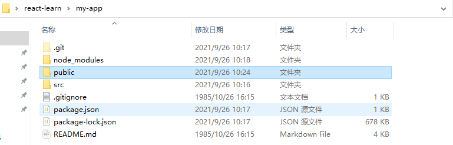
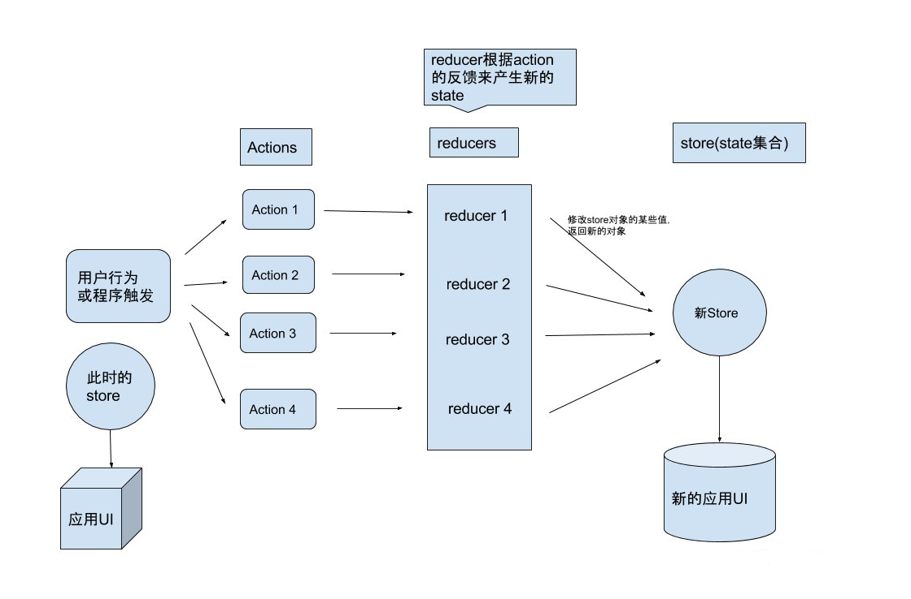
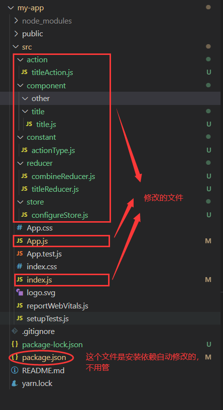
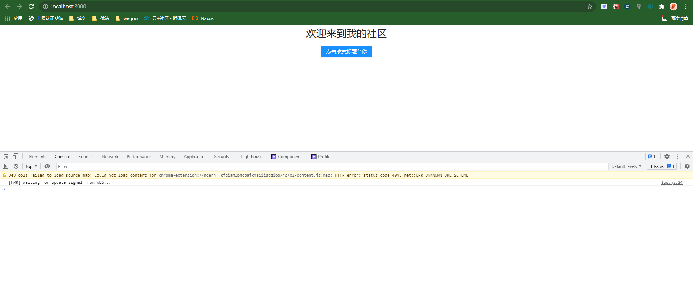
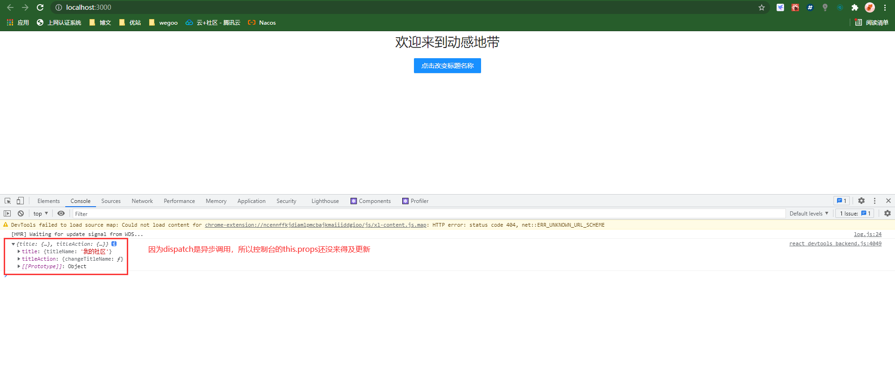
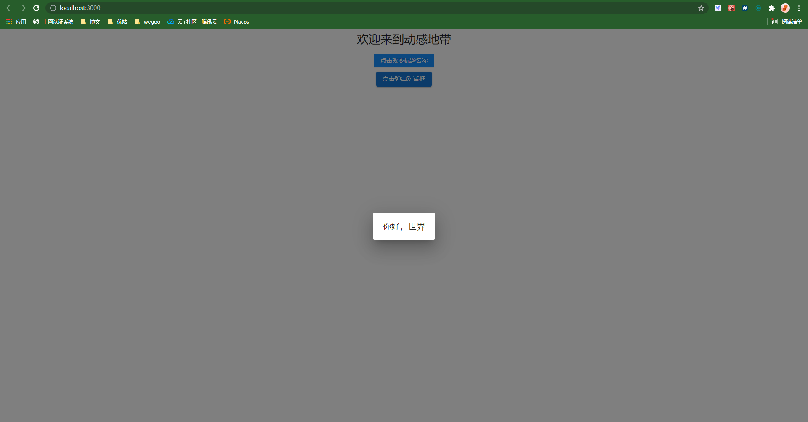
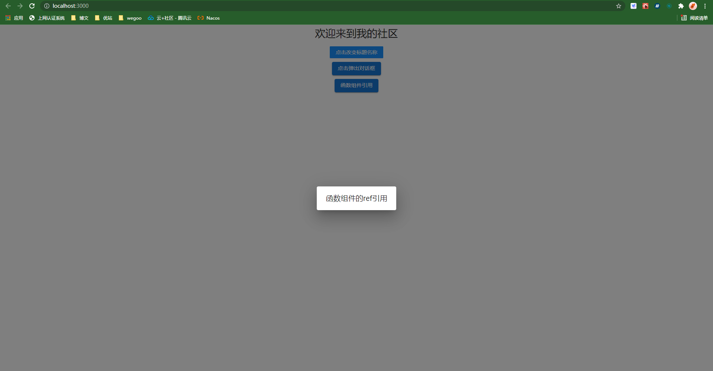
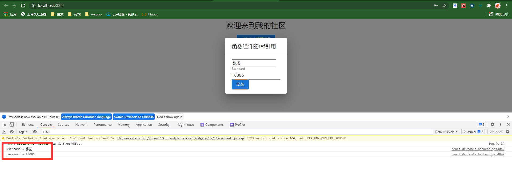
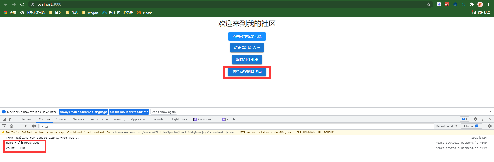
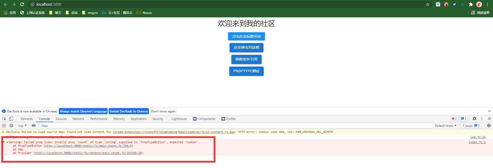

# 创建项目

## 下载安装nodeJs

点击安装并一路next即可。

## 使用脚手架创建项目

```bash
npx create-react-app my-app
cd my-app
npm start
```

如果报错 you appear to be offline.falling back to the local cache 时，请使用：

```bash
npx create-react-app my-app --use-npm
```

速度缓慢时切换npm源：

```bash
npm config set registry https://registry.npm.taobao.org
```


## 项目目录结构



## 展示config文件夹

config文件夹默认隐藏，显示命令如下：

```bash
npm run eject
//然后输入Y
```

如果报错，可能时git导致，可以删除.git文件夹再尝试。

## 导入antd组件库

地址：https://ant.design/docs/react/introduce-cn

``` bash
$ npm install antd --save
```

```jsx
// 导入样式
import { Button } from 'antd';
import 'antd/dist/antd.css'; // or 'antd/dist/antd.less'

<div>
    <Button type="primary">按钮一</Button>
</div>
```

# 事件处理

## 绑定this

在任何回调函数中使用this时都要对this进行绑定：

方法1：构造函数中绑定

```jsx
class Toggle extends React.Component {
  constructor(props) {
    super(props);
    this.state = {isToggleOn: true};

    // 为了在回调中使用 `this`，这个绑定是必不可少的
    this.handleClick = this.handleClick.bind(this);
  }

  handleClick() {
    this.setState(state => ({
      isToggleOn: !state.isToggleOn
    }));
  }

  render() {
    return (
      <button onClick={this.handleClick}>
        {this.state.isToggleOn ? 'ON' : 'OFF'}
      </button>
    );
  }
}

ReactDOM.render(
  <Toggle />,
  document.getElementById('root')
);
```

方法2：实验性语法绑定

```jsx
class LoggingButton extends React.Component {
  // 此语法确保 `handleClick` 内的 `this` 已被绑定。
  // 注意: 这是 *实验性* 语法。
  handleClick = () => {
    console.log('this is:', this);
  }

  render() {
    return (
      <button onClick={this.handleClick}>
        Click me
      </button>
    );
  }
}
```

方法3：箭头函数绑定

```jsx
class LoggingButton extends React.Component {
  handleClick() {
    console.log('this is:', this);
  }

  render() {
    // 此语法确保 `handleClick` 内的 `this` 已被绑定。
    return (
      <button onClick={() => this.handleClick()}>
        Click me
      </button>
    );
  }
}
```

## 向事件处理程序传递参数

```jsx
<button onClick={(e) => this.deleteRow(id, e)}>Delete Row</button>
<button onClick={this.deleteRow.bind(this, id)}>Delete Row</button>
```

# 路由设置

文档：http://react-guide.github.io/react-router-cn/docs/Introduction.html

## 导入路由包

```bash
npm install --save react-router
```

或

```bash
npm install --save react-router-dom
```

- react-router：是基本的router包，里边函的内容较多，但是在网页开发中有很多用不到，现在的市面上的课程讲的基本都是这个包的教程。

- react-router-dom：随着react生态环境的壮大，后出现的包，这个包比react-router包轻巧了很多。


注意：其实安装了react-router包就不用安装了react-router-dom包了，这里只是为了给大家一个提示，所以安装了两个包。在实际开发中，请根据需要进行安装。安装时使用--save，因为这是要在生产环境中使用的。

## 创建路由组件

```jsx
import React from 'react';
import { HashRouter,Route,Switch } from 'react-router-dom';
import { createHashHistory } from "history";

import App from '../App';
import Page1 from '../Page1';
import Page2 from '../Page2';

const hashHistory = createHashHistory();

class RouterConfig extends React.Component{
    render(){
        return(
            <HashRouter history={hashHistory}>
                <Switch>
                    <Route path='/' component={App}/>
                    <Route path='/Page1' component={Page1}/>
                    <Route path='/Page2' component={Page2}/>
                </Switch>
            </HashRouter>
        )
    }
}
export default RouterConfig;
```

## 入口配置路由组件

在index.js配置路由组件：

```jsx
import RouterConfig from './router/router.js';
ReactDOM.render(<RouterConfig/>, document.getElementById('root'));
```

## 其它组件使用路由

```jsx
<a href='#/Page1'>第一个页面</a>
```

或

```jsx
<ul className="menu">
    <li><NavLink to='/Page1'>第一个页面</NavLink></li>
    <li><NavLink to='/Page2'>第二个页面</NavLink></li>
</ul>
```

## 使用编程式路由

```jsx
export default class Page1 extends React.Component {
    constructor(props) {
        super(props);
    }
    
    
    render() {
        return (
            <div>
                <a href='#/Page2'>去Page2</a>
                <button onClick={() => this.props.history.push('Page2')}>编程式跳转</button>
            </div>
        )
    }
}
```

# Redux

## 简介

地址：https://www.redux.org.cn/

使用前请详细阅读文档。

redux可以将redux state中的属性同步给react的 props，使得子组件可以快速使用与修改redux维护的state。

应用中所有的 state 都以一个对象树的形式储存在一个单一的 *store* 中。 惟一改变 state 的办法是触发 *action*，一个描述发生什么的对象。 为了描述 action 如何改变 state 树，你需要编写 *reducers*。

## 概念

### store、action、reducer的关系

- store：存储所有redux的state；
- reducer：修改state；
- action：告诉reducer怎么修改state；



参考博客：https://www.pianshen.com/article/844312002/

### redux的state和react的state不等价

这两者不是同一个state：

1. react 中的 state： 指的是组件的状态数据。
2. redux reducer 中的 state：指的是 store 中具体 reducer 当前的数据。

因此，当将reducer中的state赋值给react中的state后，通过dispatch方法修改了reducer中的state时，react中的state并不会相应更新。

参考博客：https://www.jianshu.com/p/728a1afce96d

## 安装

```bash
npm install --save redux
```

附加包：

多数情况下，你还需要使用 React 绑定库和开发者工具：

```bash
npm install --save react-redux
npm install --save-dev redux-devtools
```

## 创建一个React Redux 应用

官方推荐的创建 React Redux 新应用的方式是使用 [官方 Redux+JS 模版](https://github.com/reduxjs/cra-template-redux)，它基于 [Create React App](https://github.com/facebook/create-react-app)，它利用了 **[Redux Toolkit](https://redux-toolkit.js.org/)** 和 Redux 与 React 组件的集成.

```bash
npx create-react-app my-app --template redux
```

可以采用这种新的方式，也可以直接[安装](#安装)。

## 使用

以下示例基于react提供的脚手架进行演示，组件库使用了antd，需要npm导入antd依赖，还有就是redux以及react-redux的依赖：

```cmd
npx create-react-app my-app
```

### 创建ActionTypes

定义一个action类型的枚举，描述所有action，示例代码：

- src\constant\actionType.js

```jsx
/**
 * action的类型枚举
 * 
 * @author pangchun
 * @since  2021-9-29
 */

const ActionType = {
    // title的action枚举
    TITLE: {
        CHANGE_TITLE_NAME: 'CHANGE_TITLE_NAME',
    },
    // 其它的action枚举
    OTHER: {

    }
}

export default ActionType;
```

### 创建ActionCreator

也就是创建一个生成Action的函数，关于Action的结构请参考：

> 除了 `type` 字段外，action 对象的结构完全由你自己决定。参照 [Flux 标准 Action](https://github.com/acdlite/flux-standard-action) 获取关于如何构造 action 的建议。
>
> 一个标准的action结构：
>
> ```jsx
> {
> type: 'ADD_TODO',
> payload: {
>  text: 'Do something.'  
> }
> }
> ```

示例代码：

- src\action\titleAction.js

```jsx
/**
 * title的action creator
 * 
 * @author pangchun
 * @since  2021-9-29
 */

import ActionType from "../constant/actionType";

export function changeTitleName(titleName) {
    return {
        type: ActionType.TITLE.CHANGE_TITLE_NAME,
        payload: {titleName: titleName }
    };
}

// 下面可以继续定义title相关的action creator
```

### 创建Reducer

Reducer用于修改state，可以对每个组件创建一个Reducer，在reducer中要初始化state，示例代码：

- src\reducer\titleReducer.js

```jsx
/**
 * title组件的reducer
 * 
 * @author pangchun
 * @since  2021-9-29
 */

import ActionType from "../constant/actionType";

/**
 * 初始化state数据
 */
const initialState = {
    titleName: '我的社区',
}

/**
 * 返回reducer
 * reducer是一个纯虚函数，接收两个参数并返回一个state
 */
function reducer(state = initialState, action) {
    switch(action.type) {
        case ActionType.TITLE.CHANGE_TITLE_NAME:
            return (Object.assign({}, state, {titleName: action.payload.titleName}))
        default:
            return state
    }
};

export default reducer;
```

### 组合所有Reducer

正式项目开发中都需要将所有Reducer合并为一个RootReducer，并将RootReducer传递给Store，示例代码：

- src\reducer\combineReducer.js

```jsx
/**
 * 合并所有reducer,返回一个rootReducer
 * 
 * @author pangchun
 * @since  2021-9-29
 */

import { combineReducers } from 'redux';
import { default as title} from './titleReducer';

/**
 * 合并所有reducer
 * 在合并了所有reducer后，调用方式变为store.getState().title.titleName, 意思是中间多了一层title
 */
const rootReducer = combineReducers({
    title,
    //下面可以继续添加其它reducer
});

export default rootReducer;
```

### 创建Store

Store用于存储所有state，示例代码：

- src\store\configureStore.js

```jsx
/**
 * 设置store
 * 
 * @author pangchun
 * @since  2021-9-29
 */

import { createStore } from "redux";
import rootReducer from "../reducer/combineReducer";

export default createStore(rootReducer);
```

### 使用Provider嵌套根组件

参考文档：https://www.redux.org.cn/docs/react-redux/api.html#provider-store

示例代码：

- src\index.js

```jsx
import React from 'react';
import ReactDOM from 'react-dom';
import './index.css';
import App from './App';
import reportWebVitals from './reportWebVitals';
import { Provider } from 'react-redux';

// 导入store
import { default as store}  from './store/configureStore';

ReactDOM.render(
  <Provider store={store}>
    <React.StrictMode>
      <App />
    </React.StrictMode>
  </Provider>,
  document.getElementById('root')
);

// If you want to start measuring performance in your app, pass a function
// to log results (for example: reportWebVitals(console.log))
// or send to an analytics endpoint. Learn more: https://bit.ly/CRA-vitals
reportWebVitals();

```

### 在组件中关联state、dispatch到props

关联state到props，通过props可以直接获取state；关联dispatch到props，通过props可以直接修改state，而不需要通过store调用dispatch方法；

示例代码：

- src\component\title\title.js

```jsx
/**
 * title组件
 * 
 * @author pangchun
 * @since  2021-9-29
 */

import React from 'react';
// 导入antd
import { Button } from 'antd';
import 'antd/dist/antd.css';
// 导入redux相关
import { connect } from 'react-redux';
import { bindActionCreators } from 'redux';
// 导入store
// import { default as store}  from '../../store/configureStore';
// 导入action creator
import * as titleActionCreator from '../../action/titleAction';

class Title extends React.Component {
    constructor() {
        super(...arguments);
        this.state = {
            buttonName: '点击改变标题名称',
        };
    }

    handleChange = () => {
        // store.dispatch(titleActionCreator.changeTitleName('动感地带')); 这种方式是redux原生dispatch调用方式，下面的是react-redux提供的调用方式
        this.props.titleAction.changeTitleName('动感地带');
        console.log(this.props); // handleChange方法结束之前，这里的props仍然是未刷新前的props，原因是dispatch就是一个异步调用，在一系列的生命周期结束前不会更新this.props
    }

    render() {
        return (
            <div className="title">
                <h1 className="titleName">欢迎来到{this.props.title.titleName}</h1>
                <Button type="primary" onClick={this.handleChange}>{this.state.buttonName}</Button>
            </div>
        );
    }
}

/**
 * 关联redux的state到react的props
 * 子组件可以通过this.props.title.titleName直接从props取值
 */
const mapStateToProps = (state) => ({
    title: state.title, // 这里为什么可以这样写？请看combineReducers的说明
    // 可以继续添加其它要同步到props的state
});

/**
 * 绑定action creator到props
 * 子组件可以通过this.props.titleAction.changeTitleName('param');的方式直接调用reducer去修改state，而不需要通过store.dispatch
 */
const mapDispatchToProps = (dispatch) => ({
    titleAction: bindActionCreators(titleActionCreator, dispatch),
    // 可以继续添加其它要绑定到props的action
});

/**
 * 连接此组件到redux store
 * 请参考文档中的 connect api 
 */
 export default connect(mapStateToProps, mapDispatchToProps)(Title);
```

## 示例项目结构



## 测试修改state

### 修改App.js文件

测试之前要最后修改一下App.js：

```jsx
import './App.css';

// 导入title组件
import Title from './component/title/title';

function App(props) {
  return (
    <div className="App">
      <Title></Title>
    </div>
  );
}

export default App;
```


### 修改前

初始化设置的titleName已经生效：



### 修改后

dispatch方法执行后，state已经同步到props中：



# 语法写法

## const {a,  b, c} = this.props;

```jsx
const {dispatch} = this.props;
```

这段代码你可以认为是这样：

```jsx
const dispatch = this.props.dispatch;
```

那样写是 ES6 的简写形式。

## super (...arguments)

参考：https://www.cnblogs.com/weilan/p/7008614.html

props这样只获取到第一个参数，而...arguments用了es6的剩余参数可以获取到所有的参数数组：

```jsx
function func1(props){
    console.log(props);
}
function func2(...arg){
   console.log(arg);
}
func1("a");  //a
func1("a","b","c");  //a
func2("a");  //["a"]
func2("a","b","c");  //["a","b","c"]
```

## Object.assign()

参考：https://blog.csdn.net/qs8lk88/article/details/79018481

Object.assign是ES6新添加的接口，主要的用途是用来合并多个JavaScript的对象。

Object.assign()接口可以接收多个参数，第一个参数是目标对象，后面的都是源对象，assign方法将多个原对象的属性和方法都合并到了目标对象上面，如果在这个过程中出现同名的属性（方法），后合并的属性（方法）会覆盖之前的同名属性（方法）。

使用示例：

```jsx
Object.assign({}, todo, {
            completed: true
          })
```

# 使用MaterialUI

## 地址

https://mui.com/

## 安装

```
// 使用 npm
npm install @material-ui/core@next @emotion/react @emotion/styled

// 使用 yarn
yarn add @material-ui/core@next @emotion/react @emotion/styled
```

## Module not found解决

如下引入可能失败，原因是最新版的组件路径已经修改，原路径如下：

```jsx
import Button from '@mui/material/Button';
```

最新版的组件路径已经变成：@material-ui目录下的core文件夹中(node_modules可以找到@material-ui)，所以正确引入代码如下：

```jsx
import Button from '@material-ui/core/Button';
```

## Dialog使用

### 基本使用

1、子组件helloDialog.jsx：

```jsx
import * as React from 'react';
import DialogTitle from '@material-ui/core/DialogTitle';
import Dialog from '@material-ui/core/Dialog';

function HelloDialog(props) {
  const { onClose, open } = props;

  const handleClose = () => {
    onClose();
  };

  return (
    <Dialog onClose={handleClose} open={open}>
      <DialogTitle>你好，世界</DialogTitle>
    </Dialog>
  );
}

export default HelloDialog;

```

2、父组件helloButton.jsx：

```jsx
import * as React from 'react';
import Button from '@material-ui/core/Button';

import HelloDialog from '../helloDialog/helloDialog';


class HelloButton extends React.Component {
    constructor(props) {
        super(props);
        this.state = {
            buttonName: '点击弹出对话框',
            open: false,
        };
    }

    handleClick = () => {
        this.setState({
            open: true
        })
      };
    
    handleClose = (value) => {
        this.setState({
            open: false
        })
      };


    render() {
        return(
            <div className="btn">
                <Button onClick={this.handleClick} variant="contained">{this.state.buttonName}</Button>
                <HelloDialog onClose={this.handleClose} open={this.state.open}></HelloDialog>    
            </div>
        )
    }
}

export default HelloButton;
```

3、修改App.js和App.css：

js

```js
import './App.css';

// 导入title组件
import Title from './component/title/title';
import HelloButton from './component/helloButton/helloButton';

function App(props) {
  return (
    <div className="App">
      <Title></Title>
      // 挂载按钮
      <HelloButton></HelloButton>
    </div>
  );
}

export default App;
```

css：App.css是全局样式

```css
.App {
  text-align: center;
}

.btn {
  margin-top: 10px;
}
```

4、测试截图：



### 设置大小

设置对话框位置没什么意义，一般来说居中即可，关于大小设置，对话框有一个最大宽度，对话框里面用div撑开即可，当超过最大宽度时会适应在底部出现滚动条；

## 下拉框聚焦无法取消问题

原因是依赖问题，把涉及的依赖换成@material-ui/core/下的依赖即可；（应该时高版本依赖没被发现的问题）

# 组件引用（ref）

## 函数组件之间的引用（useImperativeHandle）

有父组件调用子组件方法的应用场景，这里就举个例子，由于我们开发中经常使用到函数组件，这里就以函数组件为例子，而使用函数组件时，使用ref一般结合useImperativeHandle这个Hook：

> 参考文档：https://react.docschina.org/docs/hooks-reference.html#useimperativehandle
>
> `useImperativeHandle` 可以让你在使用 `ref` 时自定义暴露给父组件的实例值。

1、定义子组件refDialog.jsx：

```jsx
import * as React from 'react';
import DialogTitle from '@material-ui/core/DialogTitle';
import Dialog from '@material-ui/core/Dialog';

function RefDialog(props) {

  // 是否展示对话框
  const [open, setOpen] = React.useState(false);

  /**
   * 自定义函数组件暴露给父组件的实例值 参考：https://react.docschina.org/docs/hooks-reference.html#useimperativehandle
   * 这里暴露给父组件一个函数
   */
  React.useImperativeHandle(props.onRef, () => {
    return {
      openRefDialog: handleOpen,
    };
  });

  //关闭对话框
  function handleClose() {
    setOpen(false);
  };

  //打开对话框
  function handleOpen() {
    setOpen(true);
  };

  return (
    <Dialog onClose={handleClose} open={open}>
      <DialogTitle>函数组件的ref引用</DialogTitle>
    </Dialog>
  );
}

export default RefDialog;

```

2、定义父组件refButton.jsx：

```jsx
import * as React from 'react';
import Button from '@material-ui/core/Button';

import RefDialog from '../refDialog/refDialog';


export const RefButton = (props) => {

    // 创建RefDialog的引用
    const RefDialogRef = React.createRef();
    const handleClick = () => {
        // 父组件调用子组件的方法
        RefDialogRef.current.openRefDialog();
    };

    return(
        <React.Fragment>
            <div className="btn">
                <Button onClick={handleClick} variant="contained">{"函数组件引用"}</Button>
                <RefDialog onRef={RefDialogRef}></RefDialog>    
            </div>
        </React.Fragment>
    );
}
```

3、挂载父组件到App.js：

```js
import './App.css';

// 导入title组件
import Title from './component/title/title';
import HelloButton from './component/helloButton/helloButton';
import { RefButton} from './component/refButton/refButton';

function App(props) {
  return (
    <div className="App">
      <Title></Title>
      <HelloButton></HelloButton>
      <RefButton></RefButton>
    </div>
  );
}

export default App;
```

4、测试截图：



## 函数组件通过ref获取文本框的值

> React获取文本框值的常见方式有两种，一是通过事件参数event.target.value获取，这种方式适合单个文本框取值；二是通过ref.current.value获取，这种方式适合多个文本框。下面主要介绍如何使用ref来取值。
>
> 参考文档：https://react.docschina.org/docs/refs-and-the-dom.html

>原生文本框与MUI文本框的使用方式有些许不同，在代码注释中已经说明。

1、修改refDialog.jsx：

```jsx
import * as React from 'react';
import { Dialog, DialogTitle, DialogContent, TextField, Button } from '@material-ui/core';

function RefDialog(props) {

  // 是否展示对话框
  const [open, setOpen] = React.useState(false);

  /**
   * 自定义函数组件暴露给父组件的实例值 参考：https://react.docschina.org/docs/hooks-reference.html#useimperativehandle
   * 这里暴露给父组件一个函数
   */
  React.useImperativeHandle(props.onRef, () => {
    return {
      openRefDialog: handleOpen,
    };
  });

  //关闭对话框
  function handleClose() {
    setOpen(false);
  };

  //打开对话框
  function handleOpen() {
    setOpen(true);
  };

  
  // 定义输入框的引用
  const username = React.useRef(null);
  const password = React.useRef(null);

  /**
   * 处理提交
   */
  function handleSubmit() {
    console.log("username = " + username.current.value);
    console.log("password = " + password.current.value);
  }

  return (
    <Dialog 
      onClose={handleClose} 
      open={open}
    >
      <DialogTitle>函数组件的ref引用</DialogTitle>
      <DialogContent dividers={true} >
        <div>
          {/* 原生输入框使用ref */}
          <input ref={username} placeholder="username"/><br/>
          {/* MUI的文本框使用inputRef 参考：https://mui.com/zh/api/text-field/ */}
          <TextField inputRef={password} type="text" label="Standard" variant="standard" />
        </div>
        <Button onClick={handleSubmit} variant="contained">{"提交"}</Button>
      </DialogContent>
    </Dialog>
  );
}

export default RefDialog;

```

2、测试截图：




## useRef和CreateRef的区别

> **useRef：**
>
> useRef 返回一个可变的 ref 对象，其 .current 属性被初始化为传入的参数（initialValue）。返回的 ref 对象在组件的整个生命周期内保持不变。
>
> **CreateRef：**
>
> Refs 是使用 React.createRef() 创建的，并通过 ref 属性附加到 React 元素。在构造组件时，通常将 Refs 分配给实例属性，以便可以在整个组件中引用它们。参考：https://react.docschina.org/docs/refs-and-the-dom.html

区别就是：useRef 仅能用在 FunctionComponent，createRef 仅能用在 ClassComponent；

1. 第一句话是显然的，因为 Hooks 不能用在 ClassComponent。

2. 第二句话的原因是，createRef 并没有 Hooks 的效果，其值会随着 FunctionComponent 重复执行而不断被初始化。而 useRef会在每次渲染时返回同一个 ref 对象。

# PropTypes类型检查

## 是什么

了解类型检查：https://react.docschina.org/docs/typechecking-with-proptypes.html；

> 随着你的应用程序不断增长，你可以通过类型检查捕获大量错误。对于某些应用程序来说，你可以使用 [Flow](https://flow.org/) 或 [TypeScript](https://www.typescriptlang.org/) 等 JavaScript 扩展来对整个应用程序做类型检查。但即使你不使用这些扩展，React 也内置了一些类型检查的功能。要在组件的 props 上进行类型检查，你只需配置特定的 `propTypes` 属性。

## 全部用法

参考：https://www.npmjs.com/package/prop-types

> 注意：react使用不需要使用npm导入依赖，已经自带。

## 示例

1、定义propTypeButton.jsx组件：

```jsx
import * as React from 'react';
import PropTypes from 'prop-types'; // 导入类型检查组件
import Button from '@material-ui/core/Button';

class PropTypeButton extends React.Component {
    constructor(props) {
        super(props);
        this.state = {
            buttonName: 'PropType测试',
        };
    }

    handleClick = () => {
        const { name, count } = this.props; // 使用props传过来的值
        this.setState({
            buttonName: '请查看控制台输出'
        });
        console.log("name = " + name);
        console.log("count = " + count);
      };
    
    render() {
        return(
            <div className="btn">
                <Button onClick={this.handleClick} variant="contained">{this.state.buttonName}</Button> 
            </div>
        )
    }
}

// 定义要进行类型检查的props值以及检查规则
PropTypeButton.propTypes = {
    name: PropTypes.string.isRequired, // 只能为字符串
    count: PropTypes.number.isRequired // 只能为数字
}

export default PropTypeButton;
```

2、在App.js中挂载并调用：

```js
import './App.css';

// 导入title组件
import Title from './component/title/title';
import HelloButton from './component/helloButton/helloButton';
import { RefButton} from './component/refButton/refButton';
import PropTypeButton from './component/propTypeButton/propTypeButton';

function App(props) {
  return (
    <div className="App">
      <Title></Title>
      <HelloButton></HelloButton>
      <RefButton></RefButton>
      {/* 设置props要传的值，name为字符串，count为数字 */}
      <PropTypeButton name={'测试propTypes'} count={100} ></PropTypeButton>
    </div>
  );
}

export default App;
```

3、测试截图：

当类型检查通过时：



当类型检查不通过时：（修改count的值为字符串 '100'）



此时vscode编辑器中编译仍然通过，但是浏览器中却能报错，有助于我们提高排查问题的速度。

# 请求后端api的几种方式

参考：https://blog.csdn.net/wzc_coder/article/details/102952328

# CSS全局污染

都知道React的Css是全局生效的，在moduleA.css中定义的类选择器在moduleB中也会生效，这就是全局污染，为了moduleA.css定义的样式只在moduleA中生效，我们可以进行如下设置：

1、首先将moduleA.css改名后引入：

```jsx
// 可以发现中间拼接了module
import moduleA from "./moduleA.module.css"
```

2、使用样式：

```jsx
 // 此时DDDD为你的类名
<div className={moduleA.DDDD}>引入外部的css样式</div>
```

3、反例：

```jsx
// 这种方式引入会污染全局css
import "./moduleA.css"
```

4、官方文档：

https://www.html.cn/create-react-app/docs/adding-a-css-modules-stylesheet/

# 省市区地址选择插件

https://fengyuanchen.github.io/distpicker/

# 动态添加组件

## 动态添加

在很多表单中会有点击按钮添加一个组件的场景，以下为示例：

```jsx
import React from "react";
import ReactDOM from "react-dom";

const BlackComponent = () => <div>我是黑色组件</div>;

class App extends React.Component {
  constructor(props) {
    super(props);
    this.state = { comps: [] };
  }

  render() {
    const { comps } = this.state;
    return (
      <div>
        {comps.map(comp => {
          return <BlackComponent key={comp} />;
        })}
        <p>---------------</p>
        <button onClick={() => this.setState({ comps: comps.concat([Date.now()]) })}>加组件</button>
      </div>
    );
  }
}

const rootElement = document.getElementById("root");
ReactDOM.render(<App />, rootElement);
```

主要参考：https://react.docschina.org/docs/lists-and-keys.html

在线示例：https://codesandbox.io/s/r794v4qwon?file=/src/index.js:0-657

## 如何让动态渲染的组件的值互相不影响

比如动态渲染了两个下拉框，当选了下拉框A时，不能让下拉框B与A同步：

> 思路：主要是设置组件的数据来源，只要来源不同就不会相互影响，在抽取模块组件时如果数据变化的组件不要直接返回元素，应返回function，通过function返回元素；

# React中的key

参考：https://react.docschina.org/docs/lists-and-keys.html


